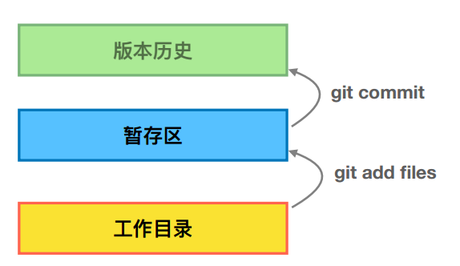

#### 这里总结下关于git的一些用法

##### 一  配置user信息

首先，我们配置user.name和user.email。

$git config --global user.name ‘your_name’

$git config --global [user.email’your_email@domain.com’](mailto:user.email’your_email@domain.com’)

备注，这里的global有何作用呢？

简单介绍下，config的三个作用域：

$git config --local （local只对仓库有效，如果缺省的话，默认等同于local）

$git config --global  (global对登录用户所有仓库有效)

$git config --system （system对系统的所有用户有效）

 

那么我们如何显示config的配置呢？加--list

$git config --list --local

$git config --list --global

$git config --list --system

 

如果我们想清除我们的user.name或者user.email，我们可以按如下：

$git config --unset --local user.name

$git config --unset --global user.name

$git config --unset --system user.name 

 

当然，优先级：local>global>system

##### 二 往仓库里添加文件

对于这部分，简单总结如下：

1）对于工作目录修改后的文件，使用以下命令上传到暂存区（这可以理解为待定区，临时保存，要习惯使用）。

$git add 文件名或是文件夹名

小技巧，对于多个文件被修改，可以使用如下命令一起更新：

$git add -u 

2）如果已经上传到暂存区，可以使用以下命令提交到历史库。

$git commit -m “注释” 

####   通过git log查看版本演变历史

$git log //查看版本历史

$git log --oneline  //一行简洁地显示

$git log --oneline --all //所有分支的演进历史

$git log --oneline --all -n4 //只看就近的4个历史

$git log --online --all --graph //以图形化形式呈现版本历史

$git help --web log //在web网页查看git log的使用方法

$git branch -v //查看本地有多少分支

#### 三 其他git常用的一些命令技巧：

- git 新建分支

  step-1:  git checkout -b ***    #建立了新的分支名称，同时切换到该分支

  step-2:  git push origin *** #将新增的分支添加到远程服务器

  

- 如何将当前分支与master进行合并

  步骤：

  step-1: git add ***         #文件提交到暂存区

  step-2: git commit -m "***"    #提交版本

  step-3: git checkout master  #切换到master分支

  step-4: git pull  #将最新的版本拉到本地

  step-5:  git checkout  *** #切换到该分支

  step-6: git merge master #与master分支合并

- git 删除服务器端的分支，则执行如下：

  step-1：git 铺设origin --delete + 分支名 

  step-2：git branch -d  + 分支名 #如果是要删除本地已经合并了的分支，则执行

  step-3：git branch -D + 分支名 #删除本地未合并的分支

- 如果是提交了两个版本，比较版本之间改动的地方

  git diff   版本号1地址     版本号2地址   #通过git log去查版本号地址

- git 回退功能

  场景1：当你改乱了工作区某个文件时，想直接丢弃工作区的修改时，用命令：

  git checkout --file 

​       场景2：当你不但乱了工作区某个文件的内容，还添加到了暂存区时，想丢弃修改，分两步：

​      step-1：用命令：git reset HEAD file #就回到了场景1

​      step-2:  按场景1操作

​      场景3：已经提交了不合适的版本到版本库时，想要撤销本次提交，参考版本回退：

​       git reset --hard *** #版本号，通过git log查询。

